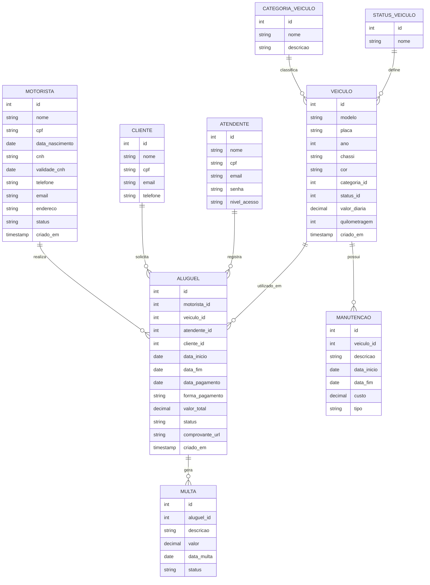

# 🚗 Sistema de Locação de Veículos

## 📋 Apresentação do Projeto

### Tema
Sistema de gerenciamento para locadora de veículos, permitindo o controle completo de motoristas, veículos, aluguéis, manutenções e multas.

### Objetivo Geral
Desenvolver um banco de dados relacional robusto, com regras de integridade e funcionalidades inovadoras (gamificação e manutenção preditiva), para otimizar a gestão operacional da locadora.
### Público-Alvo
- Administradores de locadoras de veículos
- Atendentes e operadores do sistema
- Gerentes de frota
- Clientes que alugam veículos

---

## 🏗️ Fase 1 – Estrutura Base do Banco de Dados

### 1.1 Tabelas Fundamentais

- MOTORISTA: Armazena dados pessoais e da CNH dos condutores autorizados.
- CLIENTES: Pessoa física ou jurídica que contrata o aluguel.
- ATENDENTE: Funcionários da locadora que registram os aluguéis.
- CATEGORIA_VEICULO: Classificação dos veículos (Econômico, SUV, Luxo, etc.).
- STATUS_VEICULO: Situação atual do veículo (Disponível, Alugado, Em manutenção).
- VEICULO: Frota de veículos, com modelo, placa, valor diária e quilometragem.
- ALUGUEL: Registro de cada locação, vinculando motorista, veículo, atendente e cliente.
- MANUTENCAO: Histórico de serviços realizados nos veículos.
- MULTA: Infrações associadas a um aluguel específico.

## 🚀 Fase 2 – Inovação e Prototipação
Nesta fase, foram incorporadas funcionalidades inovadoras para aumentar o engajamento dos usuários e otimizar a gestão da frota, utilizando gamificação e inteligência de dados.

### 2.1 Gamificação – Programa EcoDrive
- O objetivo é incentivar bons motoristas, recompensando-os com pontos e descontos progressivos. As novas tabelas implementadas são:

- NIVEL_FIDELIDADE
Define os níveis de fidelidade (Bronze, Prata, Ouro), com pontos mínimos e desconto percentual.

- PONTUACAO_MOTORISTA
Mantém o saldo de pontos de cada motorista, o nível atual e a data da última atualização.

### Funcionamento:
- A cada aluguel concluído, o motorista acumula pontos equivalentes ao valor total do aluguel (R$ 1,00 = 1 ponto). O sistema automaticamente recalcula o nível de fidelidade com base nos pontos acumulados.

- Dados inseridos (exemplo):

### Nível	Pontos Mínimos	Desconto
Bronze	0	0%
Prata	1.000	5%
Ouro	3.000	10%
### Motoristas pontuados após execução do script:

### Motorista	Pontos	Nível
Carlos Silva	0	Bronze
Ana Oliveira	900	Bronze
- Os demais motoristas inativos não foram considerados, conforme regra de negócio.

## 2.2 Inteligência de Dados – Manutenção Preditiva
### Utilizando regras simples baseadas em quilometragem, tempo sem manutenção e idade do veículo, o sistema gera insights automatizados para alertar sobre riscos de falhas.

### INSIGHT_IA_MANUTENCAO
-Armazena alertas gerados, probabilidade estimada de falha e data prevista para ocorrência.

### Regras implementadas:
- Quilometragem > 50.000 km → alerta com probabilidade de falha 70% e previsão em 60 dias.
- Última manutenção há mais de 1 ano → alerta com 50% de probabilidade e previsão em 30 dias.
- Veículos com mais de 10 anos de uso → alerta com 60% de probabilidade e previsão em 45 dias.

### Resultado da execução:
- Para os 8 veículos cadastrados, foram gerados insights indicando que a última manutenção ocorreu há mais de 1 ano (ou não há registro), com probabilidade de falha de 50% e data prevista para 30 dias após a execução.

## 2.3 Protótipo de Interface
- Foram desenvolvidas telas HTML básicas para demonstrar a interação do usuário com as funcionalidades inovadoras:
- Tela de Login – Autenticação de atendentes e administradores.
- Tela Principal (Dashboard) – Resumo de aluguéis ativos, pontuação do motorista, níveis de fidelidade e alertas de IA.
- Tela de Gamificação – Visualização do saldo de pontos, progresso para próximo nível e conquistas.
- Tela de Manutenção Preditiva – Exibição dos alertas gerados para a frota.
- Os protótipos estão disponíveis na pasta /prototipo do repositório.

## ✅ Resultados da Implementação
### A execução completa dos scripts resultou em:
- 8 veículos cadastrados, distribuídos nas categorias Econômico, Intermediário, SUV, Luxo e Pickup.
- 3 níveis de fidelidade ativos.
- 2 motoristas pontuados (Carlos Silva e Ana Oliveira).
- 8 insights de IA gerados (um para cada veículo), todos com alerta de revisão obrigatória.
- Aluguéis de exemplo com status concluído e pendente, gerando base para pontuação.
- Manutenções registradas para alguns veículos, servindo como referência para as regras preditivas.\

## 🚀 Benefícios do Modelo

* ✔️ **Integridade garantida:** Constraints `CHECK` e `FOREIGN KEY` impedem dados inválidos (ex.: CNH vencida, valor de aluguel negativo, duplicidade de CPF/placa).
* ✔️ **Proteção contra exclusões indevidas:** `ON DELETE RESTRICT` bloqueia remoção de registros com dependências ativas.
* ✔️ **Consistência transacional:** Uso de chaves estrangeiras mantém a coerência entre aluguéis, veículos, motoristas e multas.
* ✔️ **Automação de regras de negócio:** Pontuação automática no programa EcoDrive e geração de insights de manutenção preditiva.
* ✔️ **Pronto para produção:** Estrutura normalizada, scripts versionados e protótipo de interface funcional.

---
## 🏆 Diferencial

Este projeto se destaca por:

* **Constraints avançadas** – Validações de domínio (níveis de acesso, datas futuras, valores positivos) diretamente no banco.
* **Gamificação (EcoDrive)** – Sistema de pontuação e níveis de fidelidade (Bronze, Prata, Ouro) que incentiva bons motoristas com descontos progressivos.
* **Inteligência de dados** – Alertas preditivos de manutenção baseados em quilometragem, tempo sem revisão e idade do veículo.
* **Integridade referencial completa** – Relacionamentos bem definidos que evitam inconsistências operacionais.
* **Interface profissional** – Protótipos HTML que demonstram a experiência do usuário com dashboards personalizados e telas de gestão.

## 📊 Modelo de Dados Relacional

---

## 🚀 Benefícios do Modelo

* ✔️ Evita dados inválidos automaticamente
* ✔️ Protege contra exclusões indevidas
* ✔️ Garante consistência entre tabelas
* ✔️ Segue boas práticas profissionais
* ✔️ Pronto para uso em produção

---
## 🏆 Diferencial

Este projeto utiliza:

* Constraints avançadas
* Validações de negócio no banco
* Integridade referencial completa
* Interface Profissional
* 
